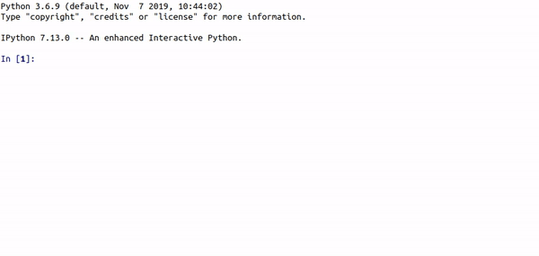

# Libclusters

Uses simple yet chemically important features to cluster small molecules. Presently, this code is designed to work with single receptor but idea can be easily framed to work with alomost every receptor.

# Why clustering ? 
To reduce the number of small molecules to be docked into the binding pocket of a protein. Hence, reducing the computational cost by 10-fold maximum.

1.3 million small molecules have been clustered and only ~100,000 were selected for further docking.

Validation has been done by docking all 1.3 million compounds and just 100,000 compounds to check minimal impact on number of hits to be obtained.

# Workflow
Fetch features from ZINC-ID

Prediction of cluster and potent inhibitors

# MD based classification of True vs False positives
model_nn_md.job is trained on 824 ligand-RPN11 complex MD simulations to predict true vs false positives.
Input cosists of features derived from Onionnet(https://github.com/zhenglz/onionnet) and PaDelPy (https://github.com/ECRL/PaDELPy).

Requirements:
sklearn, numpy and pandas

Usage:

Step1 : python automated.py -Rings -HBA -HBD -RB -logP

Step2 : if input == inhibitor: generate features from onionnet and padelpy

Step3 : python predict.py -input features_filename
